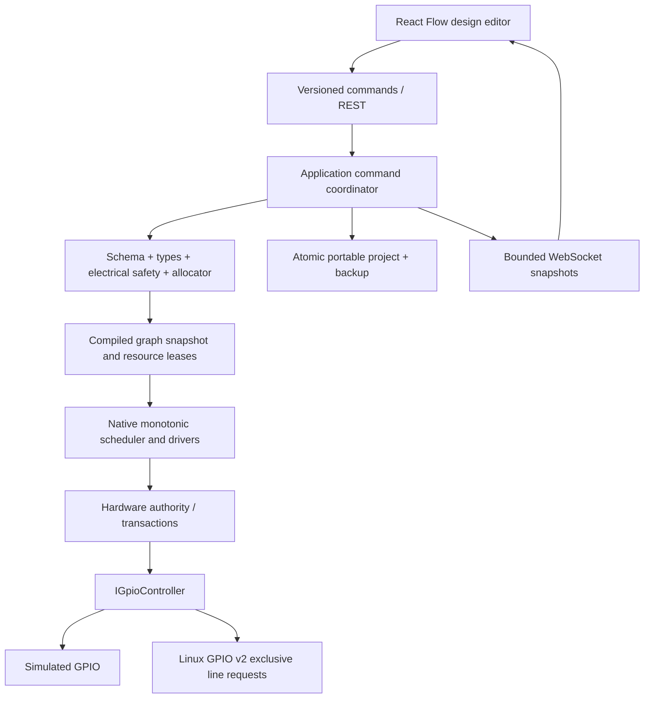

# Moon Pi architecture

Moon Pi by 17ofSeptember is a C++20 service with a static React/TypeScript client.
Simulation is the default. An opt-in Linux GPIO backend supports Pi 3 B+ outputs;
physical verification remains pending. Windows rejects hardware mode.

## Ownership and locking

Application commands and design state are serialized by the App mutex. Schemas,
registries and board data become immutable after startup. The Runtime mutex owns
compiled graph, driver objects, timers and hardware. Lock order is App then
Runtime; the runtime never calls App. A single joined `jthread` waits on a
condition variable and a monotonic timer heap; no thread is allocated per node.
Callbacks never invoke client code under the hardware lock.

CivetWeb has eight bounded workers and a 16-connection pending queue. At most four
established telemetry clients are intended; a separate publication thread emits
full state at 10 Hz, without queuing past telemetry. Socket timeout bounds slow
writes. WebSocket membership is locked while publishing to prevent use-after-free.
Native automation continues when every browser disconnects. Full snapshots make
reconnection independent of missed events. Large graph snapshot traffic remains
a performance limitation; delta coalescing is future work.

## Revisions and execution

SetDesign replaces a schema-valid portable document and increments its revision.
Semantic errors remain in Design state. Apply recompiles, rejects all errors,
reserves GPIO and verifies safe output initialization. Applying while running is
rejected. Start requires the current design to match the applied revision. Stop
cancels timers and releases outputs; Start re-requests safe outputs. Editing does
not alter a running compiled snapshot. Undo/redo changes only local design state.

Intervals skip missed ticks and never replay after restart. The first executor
supports interval Trigger output into the generic output driver's toggle input.
The driver also accepts Boolean set events for future Boolean-producing nodes.
The first slice does not claim to support every typed port's runtime semantics.

## Hardware transactions

Only HardwareAuthority mutates IGpioController. It validates unique leases,
de-energizes/releases previous outputs, prepares the complete plan at safe LOW,
checks actual snapshots, then commits ownership. Failure releases every prepared
line; old energized states are deliberately not restored. The API exposes desired
and actual values separately. Real hardware failures require additional treatment
and hardware verification before this becomes a production hardware controller.

`GpioCharacterDeviceBackend` owns line requests through an `IGpioChip`/`IGpioLine`
device seam. Linux uses GPIO v2 ioctls; tests inject chip failures through the same
backend. Requests initialize LOW atomically. Each actual snapshot reads the device;
a runtime telemetry read failure stops the graph, releases requests and produces a
visible error. Readback cannot prove the behavior of external circuitry. Startup
checks board/chip identity but does not request output lines until Apply.

## Persistence and trust

Portable JSON is authoritative. No database is necessary in this slice. Saves use
a sibling temporary file, OS flush, backup, and atomic replacement; POSIX also
syncs the parent directory. Startup detects a session marker or leftover temporary
save and never auto-runs. Corrupt originals are protected from overwrite. Unknown
project fields survive round trips; unknown components remain design nodes with
errors. Unsupported future schema versions fail closed with the original intact.

AI has no hardware reference. UnavailableAiEngine is the default, MockAiEngine is
test-only. Native Needle integration is deliberately separate from runtime work.
